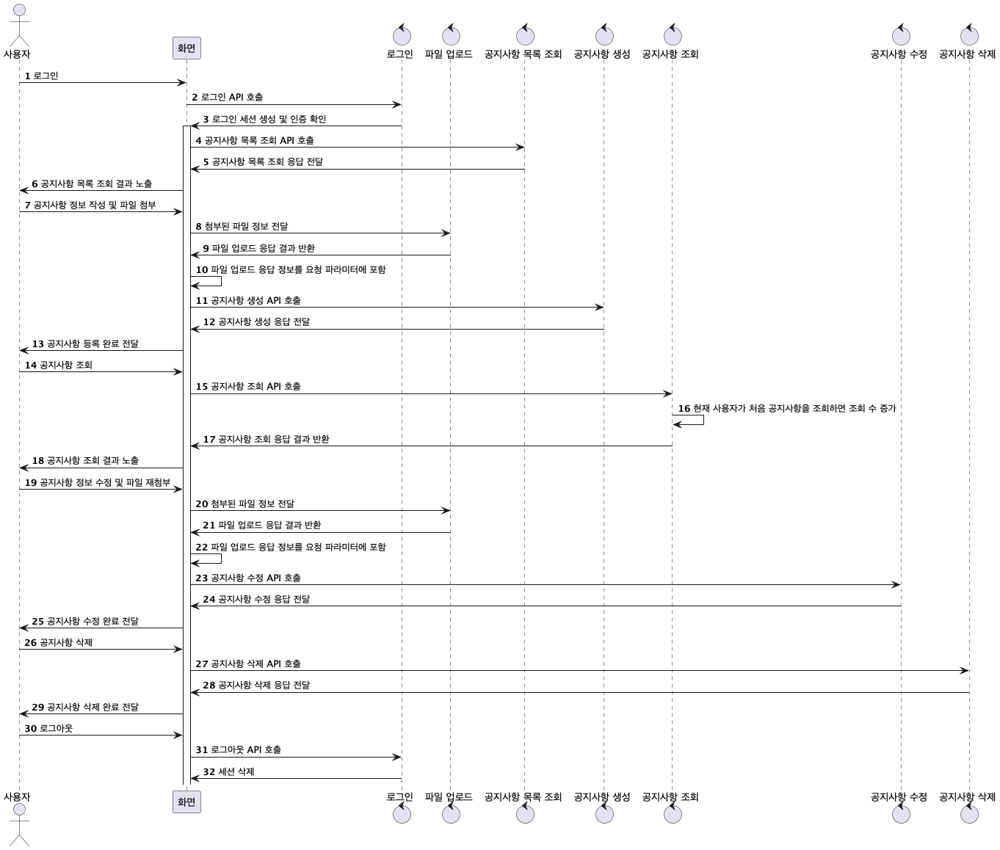

# 공지사항 관리 REST API


## 기술 스택

```
Java 21
Spring boot 3.3.4
Gradle
H2
Embedded-Redis
```

## 실행방법

1. 터미널을 실행해 git clone 명령을 통해 프로젝트를 가져옵니다.
```
git clone https://github.com/gaegulgaegul/rsupport-notice.git
```
2. 프로젝트 경로로 이동합니다.
```
cd rsupport-notice
```
3. gradle 명령을 통해 프로젝트를 빌드합니다.
```
./gradlew clean build
```
4. 빌드된 프로젝트 jar를 실행합니다.
```
java -jar build/libs/rsupport-notice-0.0.1-SNAPSHOT.jar
```
5. 아래 URL을 통해 API 기능과 데이터를 확인할 수 있습니다.
   - 사용자 관리 API는 구현하지 않고 기초 데이터 10건을 실행 시 추가하고 있습니다.
- [Swagger-ui](http://localhost:8080/swagger-ui/index.html)
- [H2-Console](http://localhost:8080/h2-console)
- 임베디드 레디스 cli 접근
  1. 터미널을 실행하여 redis-cli를 설치합니다.
  ```
  brew install redis
  ```
  2. 프로젝트를 실행하고 redis에 접근합니다.
  ```
  redis-cli -h localhost -p 6379
  ```
  3. 아래 명령으로 레디스 세션 또는 캐시 정보를 확인할 수 있습니다.
  ```
  # 레디스 내 데이터 모든 key 목록 확인
  > keys *
  
  # 레디스에 캐싱된 공지사항 정보 확인
  #  - noticeId: 공지사항 ID
  > get notices::{noticeId}
  ```
## 시나리오



## 문제해결

### 공지사항 - 파일의 관계

공지사항은 파일을 관리할 수 있지만 파일은 공지사항 정보를 몰라도 존재할 수 있습니다.<br/>
공지사항에서 파일을 관리할 수도 있지만, 공지사항과 파일의 결합도가 높아져 파일 요구사항이 수정되면 공지사항도 같이 수정해야 되기 떄문에
이를 분리하여 공지사항과 파일은 독립적으로 존재하고 공지사항에서 첨부된 파일을 매핑할 수 있도록 했습니다.

### 삭제된 공지사항에 첨부된 파일
공지사항과 파일 API가 분리되어 있어 파일을 첨부하여 공지사항을 등록하였지만 공지사항을 삭제하면 더미 파일로 남아있게 됩니다.
공지사항 삭제 시 파일에서 삭제 flag 상태를 변환해주고 스케쥴링을 통해 매일 자정에 해당 플래그가 true인 파일 경로를 삭제합니다.

### 공지사항 조회수 증가
공지사항을 조회하면 조회수를 1증가하면 되지만 한 사용자가 공지사항을 여러번 조회하면 계속 증가하게 됩니다.<br/>
공지사항에 조회 사용자 관리를 매핑하고 현재 세션에 존재하는 사용자를 확인하여 공지사항 중복 조회 수 증가를 해결했습니다.

### 대용량 데이터 처리 - 레디스 적용
세션을 통해 인증 방식을 선택하여 세션 정보를 관리할 수 있는 저장소를 따로 구성해야 했는데,<br/>
여러 방법이 있지만 동시에 캐시도 관리할 수 있는 레디스를 통핸 세션/캐시 관리 방식을 선택하였습니다.  

#### 캐싱된 공지사항 데이터 수정
등록된 공지사항을 수정하면 레디스 데이터를 갱신되지 않는 이슈가 발생했습니다.<br/>
이슈 원인은 캐싱된 데이터는 공지사항 조회 응답 규격인데 ```@CachePut```이 적용된 공지사항 수정은 반환 정보가 없었습니다.<br/>
따라서 공지사항 수정이 완료되면 수정된 공지사항 엔티티를 공지사항 조회 응답 규격으로 변환하여 반환하여 캐싱 정보를 수정할 수 있었습니다.

#### 공지사항 조회수 캐싱 처리
```java
@Cacheable(value = "notices", key = "#notice.id", cacheManager = "redisCacheManager")
@Transactional
public NoticeReadResponse read(Long noticeId, Account account) {
	NoticeEntity notice = noticeRepository.findById(noticeId)
		.orElseThrow(() -> new ApplicationException(NoticeErrorCode.NO_CONTENT));

	if (notice.isNotViewed(account.getId())) {
		notice.view(account.getId());
		noticeRepository.save(notice);
	}

	return toResponse(notice);
}
```
```@Cachable```이 적용된 공지사항을 조회하는 로직에서 공지사항 조회수 증가 로직을 따로 분리하여 아래와 같이 적용하였습니다.
```java
@CachePut(value = "notices", key = "#notice.id", cacheManager = "redisCacheManager")
public void increaseViewCount(NoticeEntity notice, Account account) {
    notice.view(account.getId());
    noticeRepository.save(notice);
}
```
직접 조회를 해보니 첫 조회에서는 캐싱이 되지만 두번째 조회부터 캐싱 정보만 반환되는 이슈가 발생했습니다.
위 문제처럼 반환 정보가 없어 이를 추가하고 실행했습니다.
```java
@CachePut(value = "notices", key = "#notice.id", cacheManager = "redisCacheManager")
public NoticeReadResponse increaseViewCount(NoticeEntity notice, Account account) {
    notice.view(account.getId());
    noticeRepository.save(notice);
    return toResponse(notice);
}
```
하지만 첫 조회에서는 캐싱이 되지만 두번째 조회부터 캐싱 정보만 반환되는 이슈가 계속 발생하였습니다.
이 이슈의 문제점은 ```@Cachable```은 조회에서만 적용되고 ```@CachePut```은 변경에서만 적용되니 ```@Cachable```을 toResponse()에 적용하여 이슈를 처리했습니다.

### 공지사항 조회 규격에 맞지 않는 필드
레디스 캐시를 사용할 때 직렬화 이슈로 인해 캐싱 정보에 클래스 정보를 같이 가지는 설정을 추가했는데, 공지사항 조회 응답에 @class 필드가 포함되어 조회되었습니다.
```json
{
  "@class": "com.project.application.notice.dto.response.NoticeReadResponse",
  "noticeId": 1,
  "title": "2024년 하반기 공지사항",
  "content": "출퇴근 기록 준수",
  "viewCount": 1,
  "createdAt": "2024-09-27T14:55:31.867474",
  "createdBy": 1,
  "lastModifiedAt": "2024-09-27T14:55:31.867474",
  "lastModifiedBy": 1,
  "files": []
}
```
응답 DTO에서 필드를 추가하여 제외하려 했지만 다른 정보를 캐싱할 때도 똑같이 응답 DTO에서 제외 처리를 해야하는 번거로움이 있어 필터를 통해 처리하도록 했습니다.
```ContentCachingResponseWrapper```를 사용해 API 응답 결과를 가져와 응답 본문에서 @class 필드를 제외하고 전달하는 로직을 추가하여 해결했습니다.
